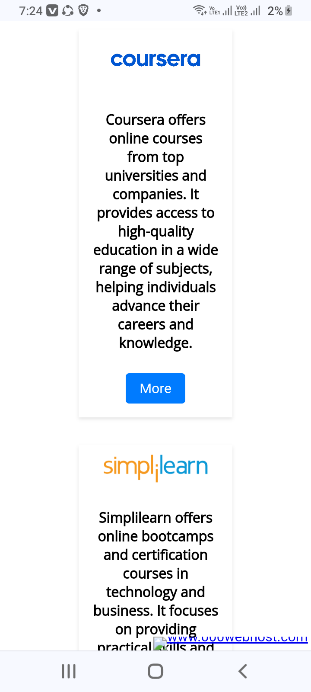
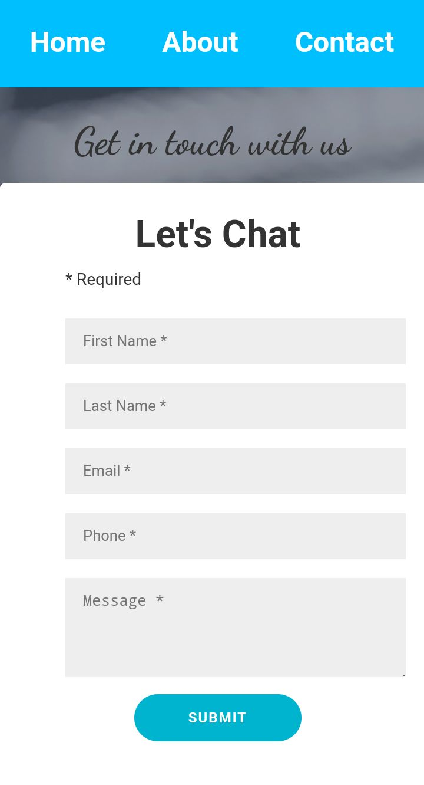
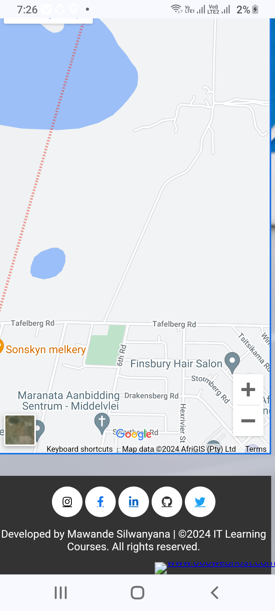

# it-course-hub
Welcome to IT Courses Hub, your one-stop destination for accessing a variety of IT learning courses from popular platforms like Coursera and Cisco. Our goal is to provide an easy-to-navigate platform where users can find the best IT courses to enhance their skills and advance their careers

You can visit the website [here](https://itcoursehub.000webhostapp.com/).

## Table of Contents

- [About](#about)
- [Features](#features)
- [Technologies Used](#technologies-used)
- [Websites Screenshots](#website-screenshots)
- [Deployment](#deployment)
  
## About
-The primary objective of creating IT Courses Hub is to provide a centralized platform that simplifies the process of finding and accessing high-quality IT learning courses, helping users easily discover and compare courses from renowned providers like Coursera and Cisco through a user-friendly interface with search and filter options, while promoting lifelong learning and supporting individuals at various career stages with diverse resources.

## Features

- **Home Section:** A welcoming banner with a brief introduction.
- **About Section:** Detailed information about my background and professional journey.
- **Services Section:** Overview of the services I offer.
- **Skills Section:** A showcase of my technical skills and expertise.
- **Projects Section:** A gallery of my projects with descriptions and links.
- **Contact Section:** A form for visitors to get in touch with me.
- **Social Links:** Links to my social media profiles for further engagement.

## Technologies Used

- **HTML:** For the structure of the website.
- **CSS:** For styling and layout.
- **JavaScript:** For interactive elements.
- **Bootstrap:** For responsive design and UI components.
- **Font Awesome:** For social media icons.
- **MYSQL:** manages data storage, retrieval, and management for IT courses, ensuring efficient handling of all database operations.
-  **PHP:** Handling tasks like user authentication and content generation, and facilitating interactions with MySQL for data management.

## Website Screenshots 
Below are some screenshots showcasing the main features and pages of IT Courses Hub. These images provide a visual overview of the user interface and functionality of the website.

<h2>Homepage</h2>

<ul><li>The Home Page serves as the main entry point for visitors to IT Courses Hub. It features a welcoming message that provides an overview of the website's purpose: to offer a centralized platform for accessing a variety of IT learning courses. The navigation menu simplifies browsing with links to essential sections like Courses, About, and Contact. Highlighted courses showcase selected offerings, while a search bar allows users to quickly find specific courses of interest.</li></ul>

<h2>About page</h2>

<ul><li>
The About Page on IT Courses Hub provides detailed information about the platform's mission, vision, and values. It aims to give users insight into the background of the website, its founders, and the motivation behind creating a centralized hub for IT learning courses.
</li></ul>

<h2> Contact page </h2>

<ul><li>The <u>Contact</u> Page aims to facilitate inquiries, feedback, and support requests, ensuring users have a reliable means to reach out for assistance or collaboration opportunities.It also includes a map integration showing a location of the organization, enhancing accessibility.</li></ul>

## Deployment 
<ul><li>  IT Courses Hub is successfully deployed on 000webhost, ensuring both accessibility and security measures are in place for optimal performance and user experience.
</li></ul>
